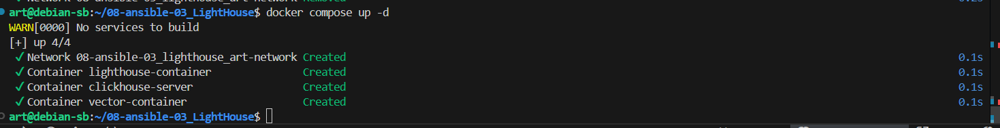
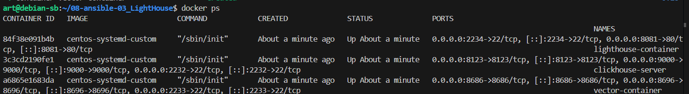
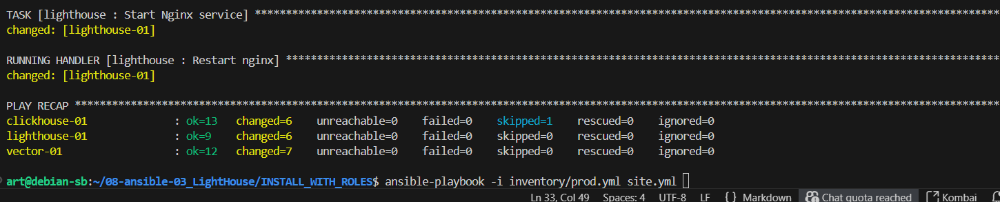
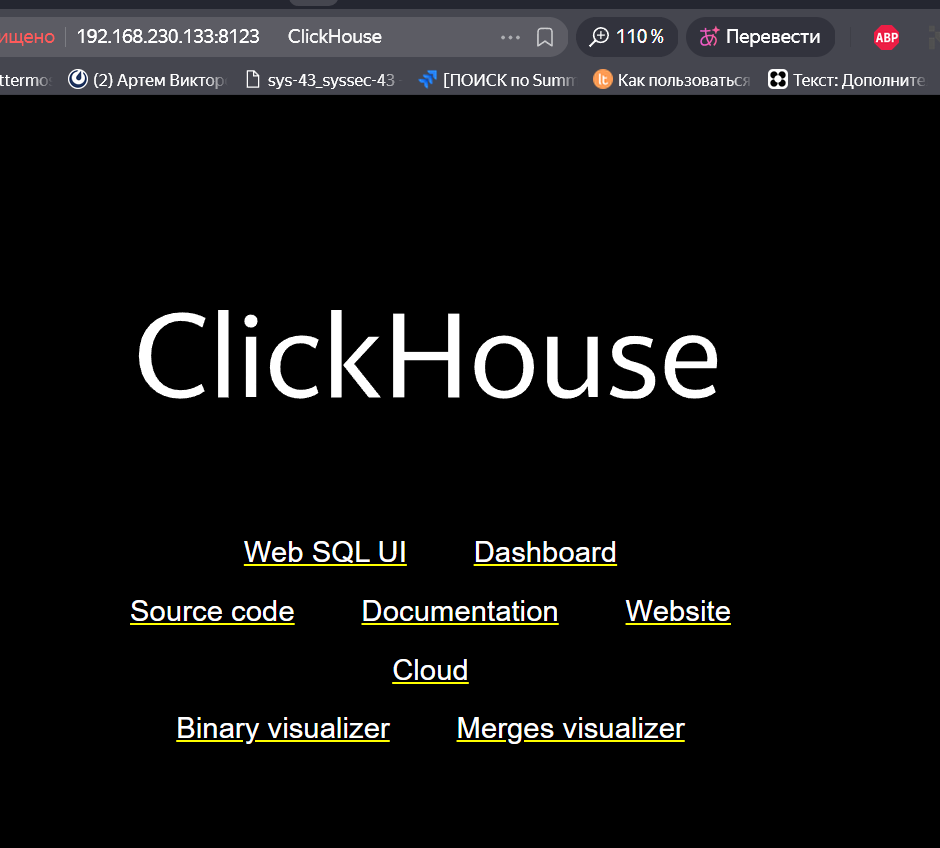
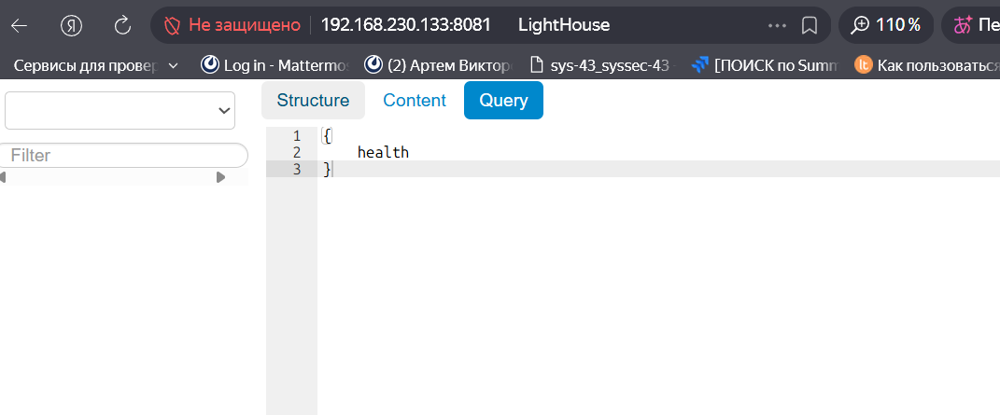
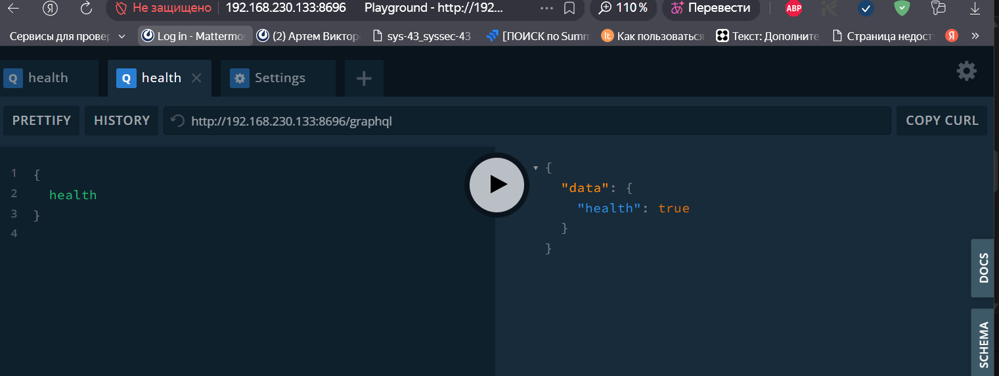
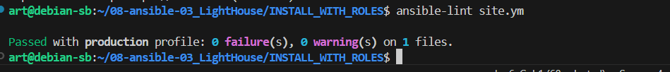
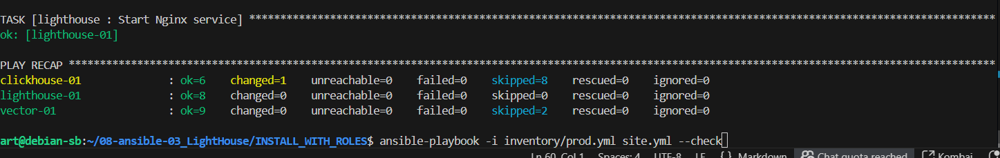
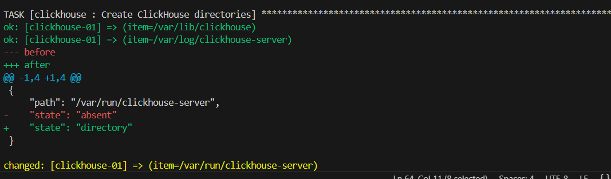
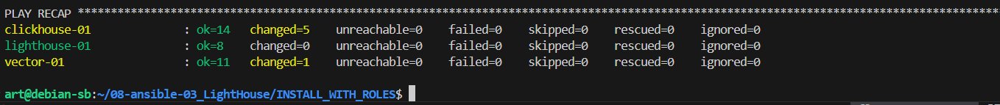

# DevOps_Netology_Homework_08-ansible-03_LightHouse
- Допишите playbook: нужно сделать ещё один play, который устанавливает и настраивает LightHouse.
- При создании tasks рекомендую использовать модули: get_url, template, yum, apt.
- Tasks должны: скачать статику LightHouse, установить Nginx или любой другой веб-сервер, настроить его конфиг для открытия LightHouse, запустить веб-сервер.
- Подготовьте свой inventory-файл prod.yml.
- Запустите ansible-lint site.yml и исправьте ошибки, если они есть.
- Попробуйте запустить playbook на этом окружении с флагом --check.
- Запустите playbook на prod.yml окружении с флагом --diff. Убедитесь, что изменения на системе произведены.
- Повторно запустите playbook с флагом --diff и убедитесь, что playbook идемпотентен.
- Подготовьте README.md-файл по своему playbook. В нём должно быть описано: что делает playbook, какие у него есть параметры и теги.
- Готовый playbook выложите в свой репозиторий, поставьте тег 08-ansible-03-yandex на фиксирующий коммит, в ответ предоставьте ссылку на него.


# Выполним задание в docker 

создадим образ из файла  ```Dockerfile_CENTOS_systemd```


```
docker build -t centos-systemd-custom -f Dockerfile_CENTOS_systemd .
```

создадим контейнеры под наши сервисы
```
docker compose up -d
```




запустим установку``` cd INSTALL_WITH_ROLES/```
```
ansible-playbook -i inventory/prod.yml site.yml 

```


проверяем работу

http://192.168.230.133:8123/

http://192.168.230.133:8081/#http://127.0.0.1:8123/


http://192.168.230.133:8696/playground


## Выполним проверки
```
ansible-lint site.ym

```



```
ansible-playbook -i inventory/prod.yml site.yml --check
```


```
ansible-playbook -i inventory/prod.yml site.yml --diff
```


